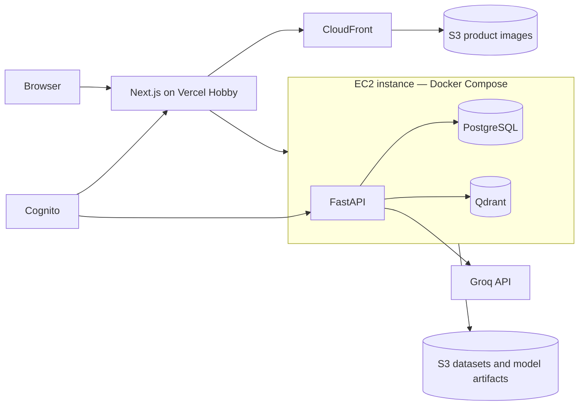

# RecSys Loom: Full-Stack Project Plan

Status: scope approved for planning
Last updated: 29 August 2026 (revised: EC2 + Docker Compose architecture, removed DynamoDB, prices omitted, impressions removed)

## 1. Project definition

RecSys Loom will be a public fashion-discovery application built on the complete H&M competition catalog. It will contain two related product surfaces:

1. A home page that recommends twelve products.
2. A search experience that accepts natural-language text, an uploaded image, or both.

The purpose is to rebuild the major layers of a production recommendation system at an honest project scale: popularity, behavioral retrieval, collaborative filtering, content and multimodal retrieval, learned ranking, immediate user-state updates, bounded LLM use, deployment, observability, and cost control.

The central engineering question is not whether one sophisticated model can replace everything. It is which evidence belongs in retrieval, ranking, reranking, and serving, and whether each additional layer fixes a measured limitation.

The deployment is intentionally simple: Vercel hosts the Next.js frontend on its free personal plan, while a single EC2 instance in AWS Mumbai (`ap-south-1`) runs the FastAPI backend, PostgreSQL, and Qdrant inside Docker Compose. S3 and CloudFront handle product images. Cognito handles authentication. A custom domain is deferred; the public entry point is the generated Vercel URL.

## 2. Decisions already made

| Area | Decision |
| --- | --- |
| Catalog | Use the complete H&M catalog, not a shoes-only subset. |
| Application access | Public web application suitable for portfolio review. |
| User modes | Visitors can browse as guests or create an account. |
| Guest behavior | Guests do not receive cross-session collaborative filtering. Their current-session actions may immediately change the page. |
| Logged-in behavior | Clicks, cart actions, and simulated purchases persist and influence future recommendations. |
| Checkout | Simulated purchase only; no payment processor, fulfillment, or real order handling. |
| Home page | A twelve-item recommendation slate with explicit fallback behavior. |
| First learned system stage | Train and evaluate retrieval before final ranking. The retrieval layer must reduce 105,542 catalog articles to roughly 100–500 candidates per user. |
| Search inputs | Natural-language text, uploaded product/style image, or both together. |
| Search representations | Text, image, metadata, lexical, and behavioral evidence remain separable so their contributions can be measured. |
| Vector database | Qdrant self-hosted on the EC2 instance inside Docker Compose. All three named vectors (text, image, behavior) fit within 1 GB RAM using on-disk storage with scalar quantization, and well within typical EBS disk. |
| Operational database | PostgreSQL on the EC2 instance (Docker Compose) is the single authoritative relational store for catalog, events, session state, and experiment metadata. Qdrant is an index, not the catalog source of truth. |
| LLM provider | Groq API. |
| LLM roles | Query intent parsing and bounded candidate reranking. |
| First learned ranker | DCN V2, trained only after candidate generation is frozen. A transparent heuristic remains the non-neural control; LightGBM is not a required project stage. |
| LLM training | No LLM-teacher distillation. Groq is evaluated as an online parser and bounded reranker, not used to manufacture ranking labels. |
| Behavior freshness | Immediate session-level effects; no request-time model retraining. |
| Prices | Omitted from the UI. The dataset's normalized price field is not a real currency value and cannot be honestly displayed. Product cards and checkout show no price. |
| Frontend | Next.js on Vercel Hobby, using the generated `*.vercel.app` production URL. No custom domain initially. |
| Backend | Python and FastAPI. |
| Architecture | Keep the existing catalog, interaction, recommendation, search, and offline-job boundaries. New ML stages are modules inside those boundaries, not new microservices. |
| Infrastructure | A single EC2 instance in AWS Mumbai (`ap-south-1`) running Docker Compose (FastAPI, PostgreSQL, Qdrant). S3 and CloudFront for images. Cognito for auth. Vercel for frontend hosting. Terraform for AWS resources. |
| Cost posture | No paid Qdrant cluster, custom domain, NAT Gateway, ALB, Lambda, Aurora, DynamoDB, or GPU job in the initial public deployment. |
| Packaging | Docker Compose for local development and the deployed EC2 instance. |
| Implementation | AI-assisted development. The project owner directs scope, architecture, and experiment decisions; AI implements directly when asked. |

## 3. Evidence already established

The repository already contains the first complete offline recommendation loop:

- A DuckDB data audit over 31,788,324 transactions, 1,371,980 catalog customers, and 105,542 catalog articles.
- Leakage-safe chronological training and validation boundaries.
- Hand-tested MAP@12, Recall@12, Hit Rate@12, and catalog-coverage evaluation.
- Global-popularity and seven-day recent-popularity baselines.
- An eight-week chronological backtest.

Current anchor results across 597,842 customer-week evaluations:

| Model | Customer-weighted MAP@12 | Macro Recall@12 | Hit Rate@12 |
| --- | ---: | ---: | ---: |
| All-history popularity | 0.00335481 | 0.00900342 | 0.02595502 |
| Seven-day popularity | 0.00573362 | 0.01835779 | 0.04896444 |

Seven-day popularity wins MAP@12 in all eight tested weeks and improves pooled MAP@12 by 70.91%. It remains volatile, reaches only twelve catalog items per fold, and is not personalized. It is an anchor, not the candidate generator for the finished system.

The next offline milestone is retrieval. Before building a learned final ranker or placing an LLM in the request path, the project must prove that it can search 105,542 articles and recover a customer's later purchases inside a candidate set of a few hundred. Popularity, repeat purchase, item-item, ALS, content similarity, and a trained two-tower model will be evaluated as candidate generators. Final MAP@12 matters only after candidate recall is understood.

## 4. Scope boundaries

### In v1

- Complete H&M product catalog and available product images.
- Next.js frontend hosted on Vercel Hobby at its generated production URL.
- Public product browsing and product-detail pages.
- Guest sessions and Cognito-backed accounts.
- Click, add-to-cart, remove-from-cart, search-result click, and simulated-purchase events.
- Immediate session-aware home-page changes.
- Persistent personalization for logged-in users.
- A trained two-tower retrieval model that maps users and articles into the same embedding space.
- Qdrant serving of learned article vectors and retrieval of roughly 100–500 candidates.
- Natural-language product search.
- Query-by-image search.
- Combined text-plus-image search.
- Qdrant-based lexical, semantic, and visual retrieval.
- Groq-based structured query parsing.
- Groq-based reranking of a small, grounded candidate set.
- DCN V2 ranking over a frozen, provenance-rich candidate set.
- Offline recommender evaluation and search relevance evaluation.
- AWS deployment, monitoring, secrets, budgets, and reproducible infrastructure.
- Cost-aware deployment with self-hosted Qdrant on the EC2 instance and AWS Mumbai resources.

### Explicitly outside v1

- Real payments, refunds, shipping, tax, inventory, warehouses, or reservations.
- Claims about live price, size availability, stock, or delivery dates that do not exist in the dataset.
- A seller portal or real marketplace operations.
- Online reinforcement learning.
- Real-time retraining after every click.
- An LLM that invents product IDs, searches the full catalog by itself, or overrides hard filters.
- An LLM-generated conversational shopping agent.
- LLM-teacher distillation or synthetic ranking-label generation.
- Multi-region active-active deployment.
- Kubernetes or Amazon EKS.
- Kafka/MSK solely for portfolio-scale traffic.
- A separate always-on server for every microservice.
- A final ranker trained before the retrieval stage has demonstrated adequate Recall@K.

## 5. User experiences

### 5.1 Guest home page

At the beginning of a session, the slate uses recent popularity and catalog-content candidates. As the guest clicks products, the current session is represented by recent article embeddings and categories. The recommendation service boosts related products immediately. The anonymous session is not used for cross-session collaborative filtering.

Fallback order:

1. Session-aware recommendations, when the guest has acted.
2. Content and multimodal candidates.
3. Seven-day recent popularity.
4. A deterministic catalog fallback if another dependency fails.

### 5.2 Logged-in home page

The logged-in slate combines longer-term and immediate evidence:

- recent popularity;
- repeat-purchase candidates;
- item-item co-purchase candidates;
- implicit collaborative-filtering candidates;
- metadata and multimodal similarity;
- precomputed long-term user recommendations;
- current-session interests.

The latest actions affect scoring immediately. Collaborative model parameters and long-term embeddings update on a scheduled batch, initially once per day.

### 5.3 Natural-language search

Example:

> oversized black jacket with a minimal design, not a hoodie

The LLM converts the query into a validated structure containing:

- normalized semantic query;
- supported category and garment filters;
- colors;
- visual/style concepts;
- exclusions;
- sort or ranking preferences that the catalog can actually support;
- unsupported constraints that should be reported rather than fabricated.

The retrieval system then runs lexical, text-semantic, and text-to-image searches. It merges the candidates, applies hard metadata filters, and sends only the top grounded candidates to the Groq reranker.

### 5.4 Image search

The user uploads an image. The system creates a short-lived upload, computes an image embedding, retrieves visually similar catalog products from Qdrant, applies catalog filters, and deletes the temporary upload according to a lifecycle policy.

If text accompanies the image, the system combines visual similarity with the parsed textual intent. This allows queries such as “something like this, but blue and more formal.”

### 5.5 Simulated checkout

A simulated purchase creates a durable event and shows a success state. It does not create a charge. The event has stronger recommendation evidence than a click, but the exact relative event weights must be selected through an experiment rather than assumed.

## 6. System architecture



The services run as a single FastAPI application inside Docker Compose on one EC2 instance alongside PostgreSQL and Qdrant. They are separated by code boundary (catalog, interaction, recommendation, search, offline jobs), not by deployment unit. A monorepo with independent service packages, tests, and Terraform modules is the appropriate starting point.

## 7. Service catalog

### 7.1 Catalog service

Responsibilities:

- authoritative product metadata;
- product-detail responses;
- category, color, garment, section, and collection filters;
- product-image keys and variants;
- batch catalog import and validation;
- safe lookup of candidate IDs returned by other services.

Example endpoints:

- `GET /catalog/products/{article_id}`
- `GET /catalog/products`
- `POST /internal/catalog/batch-lookup`

Primary store: PostgreSQL.

### 7.2 Interaction service

Responsibilities:

- accept product clicks, cart actions, searches, and simulated purchases;
- assign or accept an idempotency key;
- validate actor, article, event type, timestamp, and context;
- keep guest and logged-in identities distinct;
- maintain recent session state;
- emit data for offline training and analytics.

Example endpoints:

- `POST /events`
- `POST /checkout/simulated`
- `GET /sessions/{session_id}/recent-actions`

Primary store: PostgreSQL, indexed on `(actor_id, occurred_at)` for recent per-actor reads and append-heavy event writes.

Every event should include:

```text
event_id
idempotency_key
occurred_at
actor_type: guest | user
actor_id
session_id
event_type
article_id
surface: home | search | product | cart
request_id
position
query_id, when applicable
model_version
```

### 7.3 Recommendation service

Responsibilities:

- retrieve candidates from every enabled source;
- combine long-term and immediate user evidence;
- deduplicate article IDs;
- apply lightweight pre-ranking;
- apply diversity and seen-item rules;
- return the final home-page slate and source diagnostics;
- fall back safely when collaborative models or Qdrant are unavailable.

Example endpoint:

- `GET /recommendations/home?limit=12`

Primary stores: PostgreSQL for session state, cached/precomputed slates, and catalog facts, and Qdrant for similarity retrieval.

### 7.4 Search service

Responsibilities:

- orchestrate query parsing;
- create text or uploaded-image embeddings;
- run lexical, semantic, and visual retrieval;
- apply catalog filters;
- merge and deduplicate candidate lists;
- invoke the bounded Groq reranker;
- return results with retrieval and model-version diagnostics.

Example endpoints:

- `POST /search/text`
- `POST /search/image-upload-url`
- `POST /search/image`
- `POST /search/multimodal`

Primary stores: Qdrant for retrieval, PostgreSQL for authoritative product facts, and S3 for short-lived query images.

### 7.5 Offline ML and indexing jobs

This is an event-driven job boundary, not a public request service.

Responsibilities:

- create chronological training snapshots;
- train collaborative and ranking models;
- compute item, product, and user representations;
- generate product text and image embeddings;
- upsert versioned points into Qdrant;
- precompute logged-in user candidates;
- evaluate new models before promotion;
- export reproducible metrics and manifests.

Runtime: Docker images in ECR, executed as scheduled or one-off ECS Fargate tasks through EventBridge Scheduler. Heavy experiments may run locally first and publish only approved artifacts.

## 8. Data ownership

Qdrant must never become the source of truth for product data. A Qdrant point stores enough payload for filtering and diagnostics, but the catalog service validates IDs and returns final product facts.

### PostgreSQL

PostgreSQL runs as a Docker container on the EC2 instance. Suggested logical schemas:

- `catalog`: article metadata, normalized attributes, image assets, catalog versions.
- `events`: interaction events indexed on `(actor_id, occurred_at)`, session state, and online user signals.
- `experiments`: model versions, index versions, evaluation summaries, promotion status.
- `app`: minimal user preferences not owned by Cognito.

Events are append-heavy and read by actor plus time. At portfolio traffic levels, PostgreSQL handles this pattern without a separate key-value store. Events are exported to S3/Parquet for offline training.

### Qdrant (self-hosted)

Qdrant runs as a Docker container on the EC2 instance. One point represents one `article_id`. Initial named vectors:

- `text_dense`: semantic representation of normalized product metadata and description.
- `image_vision`: image representation from a shared vision-language model.
- `behavior_item`: item representation learned from co-purchase or collaborative behavior, added only after the relevant experiment.
- optional sparse vector for lexical retrieval.

Payload fields should contain only filtering and traceability data such as catalog version, product type, product group, section, garment group, color, and whether an image exists. Create payload indexes only for fields used by filters.

#### Capacity estimate for all three named vectors

All three dense vectors fit comfortably on the EC2 instance using on-disk storage with scalar int8 quantization. Estimated storage and RAM for 105,542 articles:

| Vector | Likely dim | Disk (float32) | Quantized RAM (int8) |
| --- | ---: | ---: | ---: |
| `text_dense` | 384 | 155 MB | 39 MB |
| `image_vision` | 768 | 309 MB | 77 MB |
| `behavior_item` | 128 | 52 MB | 13 MB |
| **Total vectors** | | **516 MB** | **129 MB** |

Add ~50 MB for HNSW graphs (three vector spaces) and ~35 MB for payloads and metadata. Total RAM: ~214 MB. Total disk: ~600 MB. Both fit within a `t3.medium` instance (4 GB RAM, 30+ GB EBS) with room for PostgreSQL and FastAPI.

Exact dimensions depend on the chosen embedding models and will be confirmed during the retrieval experiments. Even at 768-dim across all three vectors, disk stays under 1 GB and quantized RAM under 300 MB. Keep vector payloads small, use on-disk vectors and scalar quantization as the default, and retain the rebuild manifest so the index is recoverable from S3 artifacts.

### S3

Suggested prefixes or buckets:

```text
catalog-images/original/
catalog-images/card-webp/
catalog-images/detail-webp/
query-images/temporary/
ml-data/snapshots/
ml-data/features/
ml-artifacts/models/
ml-artifacts/evaluations/
```

Temporary query images require automatic expiration. Training snapshots and models require immutable versioned keys and manifests.

## 9. Image delivery and processing

Product images will be stored in a private S3 origin and delivered publicly through CloudFront using Origin Access Control. Browsers should not receive direct S3 object URLs.

At ingestion time, generate fixed variants rather than transforming every image on demand:

- card thumbnail;
- search-result thumbnail;
- product-detail image;
- modern WebP format, with a fallback only if required.

Use immutable, versioned object keys and long-lived cache headers. Next.js should use the CloudFront host as the approved remote image source.

Query-image flow:

1. Search service issues a short-lived presigned upload URL.
2. Browser uploads directly to a dedicated temporary S3 prefix.
3. Search service validates type and maximum size.
4. Embedding component downloads and embeds the object.
5. Lifecycle rules delete query images automatically.

## 10. Search and retrieval design

### 10.1 Catalog embedding pipeline

For every article:

1. Normalize supported metadata fields without changing raw source data.
2. Build a canonical text document from product name, product type, group, color, section, garment group, and description.
3. Generate a text embedding.
4. Generate a vision embedding when an image exists.
5. Upsert named vectors and indexed payload fields into a versioned Qdrant collection.
6. Verify count parity, missing-vector counts, duplicate IDs, and sampled nearest neighbors.
7. Promote the new collection through an alias only after evaluation passes.

The first embedding benchmark should compare small open text models and a shared vision-language model such as OpenCLIP or SigLIP. Model names are not frozen until retrieval quality, latency, memory, and deployment cost are measured on this catalog.

### 10.2 Text-query retrieval

```text
Raw query
   -> Groq intent parser
   -> validated filters + normalized semantic text
   -> lexical retrieval
   -> text-dense retrieval
   -> text-to-image retrieval
   -> reciprocal-rank or weighted fusion
   -> hard catalog filters
   -> lightweight pre-rank
   -> Groq rerank of top candidates
   -> final catalog validation
```

Lexical retrieval protects exact names, colors, categories, and product terminology. Dense text retrieval handles paraphrases. Text-to-image retrieval captures visual concepts expressed in language. These candidate lists must be logged separately so retrieval recall can be attributed to a source.

### 10.3 Image-query retrieval

```text
Uploaded image
   -> image validation
   -> vision-language image encoder
   -> Qdrant image-vector search
   -> optional text filters
   -> catalog validation
   -> final rank
```

### 10.4 Fusion

Start with Reciprocal Rank Fusion because it combines rankings without pretending raw scores from different models are calibrated. A learned fusion or ranker is allowed only after a labeled query set exists.

### 10.5 Personalization in search

The current query must be able to override purchase history. Personalization is initially a bounded feature or tie-breaker, not an unconditional filter. Evaluate personalized search separately for broad queries and narrow explicit queries.

## 11. Groq LLM contract

The application will use the Groq API through a small provider interface so model IDs can change without rewriting search logic. Model availability and deprecations must be checked during deployment.

### 11.1 Intent parsing

Use Groq Structured Outputs with a JSON Schema when the selected active model supports it. The parser returns fields such as:

```json
{
  "semantic_query": "minimal oversized black jacket",
  "product_types": ["Jacket"],
  "colors": ["Black"],
  "garment_groups": [],
  "style_terms": ["minimal", "oversized"],
  "exclude_terms": ["hoodie"],
  "unsupported_constraints": [],
  "confidence": 0.94
}
```

All output is validated with Pydantic. Filter values are mapped against the catalog’s known domains. Unknown values become semantic text or unsupported constraints; they do not become arbitrary SQL or Qdrant filters.

Fallbacks:

1. Cached parse for the normalized query.
2. Deterministic keyword/category parser.
3. Raw semantic query with no optional filters.

### 11.2 Candidate reranking

The reranker receives:

- parsed intent;
- no more than a small bounded candidate set, initially 20–30 products;
- article IDs and compact catalog facts;
- retrieval-source scores or ranks;
- optional user-preference summary for logged-in users.

It returns only an ordered list of candidate IDs and optional per-candidate reason codes. The service must:

- reject out-of-set IDs;
- deduplicate IDs;
- fill missing IDs using the pre-LLM rank;
- enforce a timeout;
- fall back to the deterministic rank on any Groq error or rate limit;
- record prompt version, model ID, latency, token usage, and fallback reason.

The LLM never sees the whole catalog and never directly executes a filter or database query.

### 11.3 LLM evaluation gate

Groq stays in the serving path only if it beats the non-LLM system on the same candidates and labeled queries while meeting the latency and failure budget. Compare:

1. Retrieval without LLM parsing.
2. Retrieval with LLM parsing.
3. The same candidates with deterministic ranking.
4. The same candidates with Groq reranking.

This isolates whether the improvement came from query understanding, candidate retrieval, or reranking.

## 12. Recommendation design

### 12.1 The required funnel

The home-page system cannot score all 105,542 articles with an expensive ranker on every request. It needs a funnel:

```text
105,542 catalog articles
        ↓
specialized candidate generators
        ↓
roughly 100–500 deduplicated candidates
        ↓
feature hydration and pre-ranking
        ↓
roughly 20–100 final-ranker candidates
        ↓
diversity and catalog rules
        ↓
12 products on the home page
```

Retrieval is therefore the next model problem. Its job is not to put the twelve products in perfect order. Its job is to avoid discarding products the customer later purchases while removing more than 99% of the catalog from expensive scoring.

### 12.2 Candidate-generation baselines

Before the neural retrieval model, implement candidate sources whose behavior is easy to inspect:

1. Seven-day recent popularity.
2. Thirty-day or time-decayed popularity.
3. Customer repeat-purchase candidates.
4. Item-item co-purchase candidates.
5. Weighted ALS collaborative retrieval.
6. Metadata/content-neighbor retrieval.

Each source should return more than twelve products—initially evaluate cutoffs of 100, 300, and 500. Every output records article IDs, source scores, source ranks, feature timestamps, and model/index versions. These systems establish whether a learned two-tower retriever adds value beyond simpler behavioral and content retrieval.

Every candidate source must emit the same provenance record before lists are merged:

```text
request_or_example_id
actor_id
article_id
source_name
source_rank
source_score
retrieved_at
feature_cutoff
model_version
index_version
eligibility_policy_version
```

After deduplication, one article keeps all contributing sources, ranks, and normalized scores. This makes it possible to train the ranker without losing source evidence, calculate how much recall each source adds, and explain why an item entered the final slate.

### 12.3 Trained two-tower retrieval model

The first neural retrieval model will be a two-tower model:

```text
Customer history and context                  Article identity and metadata
             ↓                                            ↓
         user tower                                     item tower
             ↓                                            ↓
        user embedding  ───── dot product ───────  article embedding
```

The two towers are trained so a user/history vector is close to an article purchased later and farther from sampled alternatives. After training:

- article embeddings are computed offline and written to Qdrant as `behavior_item` vectors;
- user embeddings are computed from history, stored with a model version, and refreshed on a schedule;
- Qdrant performs approximate nearest-neighbor search over the complete article index;
- the recommendation service asks for a candidate cutoff such as 300, not the final twelve.

The first user tower should use information available before the target date: a customer identifier when known, pooled or sequence-aware recent article history, history length, recency, and supported customer/context fields. The first item tower should combine article identity with catalog metadata so the experiment can measure how much metadata helps sparse and cold-item cases. Images are added only in the later multimodal ablation.

### 12.4 Training examples and leakage rules

The H&M data has purchases but no impressions or clean dislikes. Build positives chronologically:

1. Pick a purchase date inside the training period.
2. Construct the user's history strictly before that date.
3. Treat articles bought on the target date as positives.
4. Never place the target article or later events inside the user-tower input.

Transactions on the same date have no trustworthy within-day order. The first dataset should therefore use history through the previous date rather than inventing an event sequence inside a day.

Start with in-batch negatives because they are cheap and make the model trainable without labeling every unpurchased article as a dislike. Then test harder negatives drawn from popular products, the same category, or near-neighbors retrieved by the current model. Negative construction is an experiment: retain a harder strategy only if it improves chronological retrieval recall rather than merely lowering training loss.

### 12.5 Retrieval serving in Qdrant

The model artifact and Qdrant collection form one versioned serving unit:

```text
model_version
feature_schema_version
training_cutoff
item_embedding_dimension
distance_metric
qdrant_collection_version
indexed_article_count
created_at
```

Promotion checks must confirm that every eligible article has at most one point, vector dimensions match the model contract, payload filters work, and a sampled exact search agrees closely enough with approximate search. A Qdrant alias switches traffic to a new collection only after those checks pass.

#### Eligibility is a measured stage

The H&M files do not contain live stock, sizes, or authoritative product availability. The project must not invent them. Offline experiments will instead version and compare honest catalog-eligibility policies, such as the full static catalog and an observed-before-cutoff catalog proxy.

For every validation fold, report the **eligibility ceiling**: the percentage of future relevant articles that survive the selected policy before retrieval begins. This separates failures caused by catalog policy from failures caused by retrieval. Filters that Qdrant can apply safely should be pushed into retrieval; catalog existence and any exact rules are checked again after candidate merging. A ranker never receives an ineligible article.

### 12.6 Retrieval evaluation gate

MAP@12 alone cannot diagnose candidate generation. Evaluate every retriever at `K = 100, 300, 500` with:

- micro and macro Recall@K over unique validation purchases;
- percentage of customers with at least one relevant candidate;
- warm-user, cold-user, warm-item, and cold-item recall;
- history-size segments;
- catalog coverage and popularity concentration;
- mean candidates returned after filtering and deduplication;
- exact-versus-ANN recall on a sampled set;
- p50 and p95 retrieval latency;
- index build time, size, and freshness.

For each candidate source, also report:

- standalone Recall@K;
- union Recall@K after adding that source to the current system;
- marginal recall: relevant articles recovered by that source that the existing union missed;
- overlap with every other source;
- candidates contributed after eligibility filtering and deduplication.

Candidate budgets are allocated using marginal recall, not by giving every source the same arbitrary quota.

Compare at least these systems on identical chronological folds:

1. Popularity-only top K.
2. Union of repeat-purchase and item-item candidates.
3. Weighted ALS.
4. Metadata/content retrieval.
5. Two-tower retrieval.
6. A union of the strongest complementary sources.

Choose the smallest cutoff that preserves an agreed amount of attainable relevant-item recall. Do not train the final ranker until this report shows what the candidate stage recovers and which user/item segments it misses.

### 12.7 User state and immediate personalization

Recommendation state has three separate time horizons:

| State | What it contains | Refresh and use |
| --- | --- | --- |
| Long-horizon profile | Stable preferences inferred from older purchases and the scheduled user-tower embedding. | Rebuilt by the offline job and used for logged-in retrieval. |
| Recent-interest sequence | A bounded, time-ordered window of recent article and category interactions. | Updated from persisted events and used by recency-aware retrieval and ranking. |
| Session state | The newest clicks, cart actions, searches, and simulated purchases for this browser session. | Updated immediately and used on the next request; expires for guests. |

These states are not collapsed into one permanent user vector. Their feature timestamps and version must remain visible so an old batch profile cannot masquerade as immediate intent.

“Immediate” means online state changes, not online training:

1. Interaction service persists the action.
2. Online user state records recent article IDs, categories, and timestamps.
3. Recommendation service retrieves candidates using the precomputed long-term profile plus the latest actions.
4. A recency-decayed session score boosts products similar to recent actions.
5. Seen-item, duplicate, and diversity rules construct the final slate.

For guests, the state expires with the session and never enters collaborative filtering. For logged-in users, events are included in the next scheduled offline snapshot.

The daily two-tower user embedding represents longer-term behavior. The latest session actions modify the query vector or add a separate session-similarity candidate source at request time. This lets a click affect the next slate without retraining either tower.

### 12.8 Ranking stages

- Candidate generation: maximize recovery from specialized sources.
- Pre-ranking: cheap score that reduces the merged pool.
- Learned ranking: combine user, item, context, source, and freshness features after labels exist.
- Slate reranking: remove duplicates, limit near-identical variants, improve category/color diversity, and apply hard catalog constraints.

The first learned ranker is DCN V2. It trains only on candidates produced by the frozen retrieval stage and learns explicit crosses among user state, article metadata, candidate-source evidence, recency, popularity, and request context. The comparison is:

1. A transparent heuristic scorer on the frozen candidates.
2. DCN V2 on exactly the same candidates, chronological labels, and eligibility policy.

DCN V2 is promoted only if it improves the declared final-list metrics across chronological folds and its inference cost fits the stage latency budget. LightGBM LambdaMART would be an alternative conventional ranker for this slot, not a prerequisite; it is omitted from the required roadmap by design.

## 13. Paper-to-project adoption catalog

Only papers or production lessons with a concrete planned experiment belong in the implementation catalog.

| Source | Lesson adopted | Project component | Smallest experiment and keep/reject rule |
| --- | --- | --- | --- |
| YouTube, **R1: Deep Neural Networks for YouTube Recommendations** | A learned candidate generator reduces a huge item corpus before a more expensive ranker. | Two-tower home-page retrieval followed by ranking. | Train user and item towers, retrieve top 100/300/500 from all 105,542 articles, and measure Recall@K separately from final MAP@12. |
| TensorFlow Recommenders, **R2: Basic Retrieval** | Two towers, in-batch negatives, top-K evaluation, and an ANN index form one reproducible retrieval loop. | First two-tower implementation contract. | Hand-check a tiny dataset, compare brute-force and Qdrant neighbors, and keep ANN only if it preserves exact retrieval quality within the declared tolerance. |
| Hu, Koren and Volinsky, **F2: Collaborative Filtering for Implicit Feedback** | Events express confidence, not clean ratings; missing actions are not dislikes. | Event weighting and ALS objective. | Compare binary purchase confidence with weighted click/cart/purchase confidence on chronological folds. |
| Koren, Bell and Volinsky, **F1: Matrix Factorization** | Collaborative latent factors capture behavioral affinity absent from content. | Logged-in recommendation candidates. | Add weighted ALS without changing the split; retain only if it improves warm-user recovery and does not collapse coverage. |
| Pinterest, **R4: Pixie** | Item graphs are a distinct, interpretable candidate source. | Co-purchase retrieval. | Compare co-purchase neighbors with popularity for users having recent purchases. |
| Etsy, **P1: Personalized Search** | Different actions and time horizons carry different strengths. | Event schema, user state, search personalization. | Ablate event types and recency windows; remove signals that add no stable gain. |
| Pinterest, **S5: PinnerFormer** | Long-term batch representations and immediate state can coexist. | Daily user representation plus session features. | Compare batch-only with batch-plus-session scoring; keep immediate features only if they improve next-action recovery. |
| Pinterest, **M1: Hybrid Search** | Text and visual retrieval are separate signals that should be fused and ranked. | Text, image, and combined search. | Compare lexical, text-only, image-only, and fused retrieval on one labeled query set. |
| Amazon, **M3/M4: Multimodal product similarity and retrieval** | Catalog text and images compensate for each other’s missing information. | Named Qdrant vectors and cold-item retrieval. | Compare text, image, and fused embeddings, especially for sparse descriptions and cold products. |
| Airbnb, **R7: Embedding-based retrieval** | ANN choice, negatives, filters, freshness, and latency are one retrieval system. | Qdrant indexing and evaluation. | Measure Recall@K, filtered-query correctness, p95 latency, and index freshness before changing ANN settings. |
| Pinterest, **K3: Lightweight ranking** | A cheap pre-ranker protects an expensive final ranker. | Candidate pool reduction. | Compare latency and retained relevance as the pool is reduced; set the smallest pool that preserves candidate recall. |
| Google, **F8: DCN V2** | Explicit feature crosses let a ranker learn interactions such as recent-category affinity and source confidence by user type. | First learned home-page ranker; extend to search only after query labels or interaction data exist. | Hold candidates and labels fixed; keep DCN V2 only if it beats the heuristic control across chronological folds and fits the ranking-stage latency budget. |
| Ai et al., **M7: Zero Attention personalized product search** | Explicit query intent should sometimes override personalization. | Personalized search feature gating. | Compare broad versus narrow queries; reject personalization where it harms explicit constraint satisfaction. |
| LlamaRec, **G6** | An LLM can rerank a bounded set produced by a cheaper retriever. | Groq reranker. | Hold candidates fixed and compare deterministic versus LLM order, latency, and failure rate. |
| Uber Michelangelo, **O1** | Training-serving feature consistency and versioning are first-class system requirements. | Feature manifests, model registry, online state. | Fail deployment when required feature/index versions do not match the model contract. |
| Pinterest Manas Realtime, **O3** | Search correctness includes index freshness and recovery from missed updates. | Catalog-to-Qdrant indexing. | Track event-to-searchable delay and rehearse replay from the last successful checkpoint. |
| Google, **E3: Accuracy and diversity** | A relevant slate can still be redundant. | Final twelve-item slate. | Add intra-list diversity and catalog coverage beside MAP@12; retain reranking only if relevance loss stays within a declared budget. |
| Mansoury et al., **E7: Feedback loops** | Exposure can amplify popularity independently of genuine preference. | Event interpretation and later simulation. | Track recommendation-source concentration and simulate repeated retraining before claiming healthy personalization. |
| Airbnb, **E1: Interleaving** | Offline improvements are not causal product lift. | Later online evaluation design. | Use only after meaningful traffic exists; until then, keep public claims limited to offline recovery and system behavior. |

## 14. Evaluation plan

### 14.1 Offline recommendation evaluation

Keep the existing chronological next-seven-day task and report:

- MAP@12;
- candidate Recall@K before ranking;
- final Recall@12;
- Hit Rate@12;
- catalog coverage;
- popularity concentration;
- warm/cold users;
- warm/cold items;
- history-size segments;
- slate diversity;
- per-stage latency once served.

Retrieval experiments report Recall@100, Recall@300, and Recall@500 before any final-ranker metric. For example, if the relevant article is absent from the top 300 candidates, no reranker can recover it. The retrieval report must also show how many relevant purchases are found uniquely by each source and how much extra recall comes from their union.

Every experiment records data cutoff, feature cutoff, candidates, model version, index version, metric code version, and random seed where relevant.

### 14.2 Search relevance set

Create a fixed, human-reviewed query suite containing:

- exact category/color queries;
- paraphrases;
- style and occasion queries;
- negative constraints;
- contradictory constraints;
- broad ambiguous queries;
- image-only queries;
- text-plus-image modifications;
- products with missing descriptions or images;
- unsupported size, stock, or delivery requests.

Label relevance on a graded scale and preserve reviewer notes. Report candidate Recall@K, NDCG@12, MRR, constraint accuracy, zero-result rate, diversity, and p50/p95 latency.

### 14.3 Online instrumentation

The public demo records clicks, cart actions, and purchases. Impressions are omitted because the H&M dataset has no impression data, so there is no offline baseline to compare against, and portfolio traffic is too thin for impression-based metrics like CTR to be meaningful. Instrument:

- result click;
- product-detail view;
- add to cart;
- simulated purchase;
- query reformulation;
- zero-result query;
- recommendation/search latency;
- fallback path;
- model and index versions.

Portfolio traffic is not sufficient for causal claims. These metrics verify product behavior and data flow, not commercial lift.

### 14.4 Artifact and reproducibility contract

Every promoted experiment is reconstructable from immutable artifacts rather than a notebook's current state:

| Artifact | Required contents |
| --- | --- |
| Dataset manifest | Source file hashes, row counts, chronological boundaries, eligibility policy, label definition, and excluded rows. |
| Feature manifest | Feature names, types, ownership, computation version, cutoff rule, missing-value behavior, and modality masks. |
| Candidate artifact | One provenance record per source contribution, merged candidate record, source budgets, and candidate cutoff. |
| Training manifest | Code commit, configuration, dependency lock, random seeds, hardware summary, negative strategy, input artifact IDs, and output model hash. |
| Model manifest | Model type, feature schema version, training cutoff, metrics, calibration if used, serialization format, and compatibility requirements. |
| Index manifest | Qdrant collection/alias, vector names and dimensions, distance metrics, payload schema, article count, embedding model hash, and build timestamp. |
| Evaluation artifact | Per-example predictions, aggregate and segment metrics, confidence intervals where used, failure counts, latency measurements, and comparison baseline. |
| Promotion record | Accepted model/index pair, declared keep/reject gate, approver, timestamp, fallback version, and rollback procedure. |

Model, feature, catalog, candidate, and Qdrant index versions must match. A mismatch blocks promotion rather than being logged as a warning.

### 14.5 Mandatory ablation matrix

The following comparisons are part of the project, not optional charts added after a favorable result:

| Question | Controlled comparison | Variables held fixed |
| --- | --- | --- |
| Which retrieval sources matter? | Each source alone, strongest union, and union-minus-one-source. | Folds, eligibility, K, labels, and evaluator. |
| Does the two-tower model add signal? | Popularity/repeat/item-item/ALS/content versus two-tower and their union. | Candidate budgets and chronological examples. |
| What should the item tower know? | Identity only versus identity plus metadata; images later. | User tower, negatives, dimension, and training examples. |
| Do harder negatives help? | In-batch versus declared hard-negative mixtures. | Architecture, examples, evaluation, and training budget. |
| How many candidates are enough? | K = 100, 300, and 500. | Retriever and evaluation fold. |
| What does eligibility remove? | Full static catalog versus observed-before-cutoff proxy. | Retriever, K, and labels; report the ceiling first. |
| Which user timescale matters? | Long-horizon only, plus recent sequence, plus session state. | Candidate set, ranker version, and request examples. |
| Does learned ranking help? | Heuristic versus DCN V2. | Frozen candidates, features available at cutoff, labels, and slate rules. |
| Which search modality helps? | Lexical, text, image, and fused retrieval. | Labeled query set, filters, K, and evaluator. |
| Where does Groq help? | Parser off/on and reranker off/on as separate comparisons. | Query set, underlying retrievers, candidates for reranking, and hard filters. |
| What does slate reranking cost? | Relevance order versus diversity/variant rules. | Ranked candidates and declared relevance-loss budget. |

Each ablation states its keep/reject threshold before the run. One experiment must not change the fold, candidates, features, and model together and then assign the outcome to the model.

### 14.6 Data-quality gates

Run these checks before training and again before promotion:

- no feature, candidate, negative, or eligibility input crosses the chronological cutoff;
- all actor and article IDs meet the declared foreign-key policy;
- duplicate purchases retain their intended quantity semantics while evaluation relevance remains unique where required;
- missing text, image, and customer fields produce explicit masks rather than silent zero values;
- candidate counts, source shares, overlap, and catalog concentration stay within measured ranges so candidate collapse is visible;
- the selected eligibility policy's ceiling and filtered counts are recorded per fold;
- Qdrant indexed counts, vector dimensions, payload schema, duplicate IDs, and sampled exact-versus-ANN agreement pass promotion thresholds;
- feature and label distributions are compared across train and validation windows so time shift is visible;
- DCN V2 never receives a feature timestamped after its example or request;
- unknown IDs, zero-result requests, stale state, and fallback usage are counted rather than dropped.

A failed gate stops the run or promotion. It does not become a footnote under the final metric.

## 15. AWS deployment plan

### 15.1 Request path

| Component | Platform/service | Reason |
| --- | --- | --- |
| Next.js frontend | Vercel Hobby | Best-fit Next.js hosting for a small personal audience, with a free generated `vercel.app` URL and no domain-registration cost. |
| FastAPI backend | EC2 instance (`t3.medium`) | Single always-on instance running Docker Compose. No cold starts, no Lambda packaging complexity, and direct access to co-located PostgreSQL and Qdrant. |
| Authentication | Cognito user pool | Public sign-up, OIDC/JWTs, and API authorization. |
| Product database | PostgreSQL (Docker on EC2) | Relational catalog, events, session state, and experiment metadata. One database for everything. |
| Vector retrieval | Qdrant (Docker on EC2) | Self-hosted named dense/sparse vectors, payload filtering, and ANN retrieval. Co-located with the API for minimal latency. |
| Images | S3 + CloudFront | Durable object storage plus cached global delivery. |
| Secrets | Environment variables and Secrets Manager | Groq API key and other credentials. Secrets Manager for rotation-capable secrets; `.env` files for local development. |

The Vercel project must not contain backend credentials or implement a second set of API routes. It calls the EC2 instance's public endpoint. The deployment contract therefore includes:

- CORS on the FastAPI application allowing the exact Vercel production and intentionally enabled preview origins;
- Cognito callback and logout URLs for the Vercel production URL;
- frontend environment variables containing public endpoints only, never Groq, database, or AWS secret values;
- direct CloudFront image URLs rather than copying catalog images into Vercel;
- static or ISR pages where possible so the frontend stays within Vercel Hobby limits;
- no Vercel image optimization for the entire catalog; image transformations remain bounded and measured.

### 15.2 Offline path

Offline ML jobs (training, embedding generation, Qdrant indexing) run directly on the EC2 instance or are triggered via SSH/cron. Heavy training that exceeds the instance's capacity runs locally and publishes artifacts to S3.

| Component | Service | Reason |
| --- | --- | --- |
| Data and model artifacts | S3 | Versioned snapshots, features, models, evaluations, and manifests. |
| Logs | CloudWatch agent on EC2 | Central service logs, alarms, and dashboards. |
| Scheduling | Cron on EC2 | Daily or manually triggered jobs without a separate orchestrator. |

### 15.3 What each AWS technology does and why it is here

| Technology | What it actually does | Why this project uses it | Main concept or failure mode to learn |
| --- | --- | --- | --- |
| **EC2** | Provides a virtual machine with a chosen instance type, OS, and storage. | Single host for Docker Compose running FastAPI, PostgreSQL, and Qdrant. No cold starts, co-located services, and predictable cost. | Instance types, security groups, EBS volumes, key pairs, AMIs, elastic IPs, and stopping versus terminating. |
| **Cognito user pool** | Stores application accounts and issues signed OIDC/JWT tokens after authentication. | It supports public sign-up and lets the API distinguish a logged-in user from a guest session. | Access versus ID tokens, token expiry, OAuth callbacks, JWT verification, account recovery, and public sign-up abuse. Cognito does not store recommendation history. |
| **S3** | Stores objects such as images, Parquet snapshots, model files, and evaluation reports. | The project has large immutable files that do not belong inside PostgreSQL or a Git repository. | Bucket policies, object keys, versioning, lifecycle rules, presigned uploads, encryption, and the distinction between object storage and a mounted filesystem. |
| **CloudFront** | Caches and serves content from edge locations in front of an origin such as S3. | Product cards should load images quickly without every browser request hitting S3 directly. | Cache keys, cache-control headers, invalidation, origin access control, and stale assets. S3 remains private while CloudFront is the public delivery path. |
| **IAM** | Defines which user or workload may perform which AWS action on which resource. | The EC2 instance role needs only the permissions required for its own S3 buckets and secrets. | Roles, policies, resource ARNs, instance profiles, least privilege, and why a broad administrator policy is not an application runtime role. |
| **VPC** | Creates a private network boundary containing subnets, routes, and security groups. | The EC2 instance lives in a VPC with a security group that allows only HTTPS/SSH inbound. | Public/private subnets, security groups, route tables, and controlling inbound/outbound traffic. |
| **CloudWatch** | Collects AWS logs, metrics, dashboards, and alarms. | Evidence for request errors, job duration, latency, fallbacks, and index age. | Structured logging, metric dimensions, retention, alarms, and controlling log-ingestion cost. |
| **AWS Budgets and cost tags** | Tracks spend against thresholds and groups cost by environment or service. | The project uses AWS credits but should still expose which component is consuming them. | Budgets alert after usage data arrives; they are not a real-time circuit breaker. Tags must be applied consistently to be useful. |
| **Terraform, not an AWS service** | Declares AWS resources and their relationships as versioned code. | The entire environment should be reproducible and reviewable instead of depending on remembered console clicks. | State files, plans, provider versions, drift, modules, imports, and safe destruction. |

### 15.4 Why a single EC2 instance instead of Lambda, Aurora, and DynamoDB

The previous plan used Lambda, API Gateway, Aurora Serverless v2, and DynamoDB. This was replaced with a single EC2 instance running Docker Compose for these reasons:

- Lambda cold starts conflict with ML model loading and the p95 latency targets.
- Aurora Serverless v2 auto-pause has 15–30 second resume latency, which breaks every request-path SLO at portfolio traffic levels.
- DynamoDB adds a separate data model, partition-key design, and export pipeline for a workload that PostgreSQL handles with one indexed table.
- Three platforms (Vercel + AWS serverless + Qdrant Cloud) create coordination overhead disproportionate to the project's traffic.

A `t3.medium` (2 vCPU, 4 GB RAM) in Mumbai costs ~$30/month. It runs FastAPI, PostgreSQL, and Qdrant side by side with no cold starts, no cross-service latency, and one deployment target.

### 15.5 Region decision

AWS is fixed to Mumbai (`ap-south-1`) for the EC2 instance, S3, and CloudFront origin. The Vercel frontend is globally hosted. Cross-region latency between Vercel's edge and Mumbai is acceptable for API calls from Indian users and portfolio reviewers.

## 16. Security and reliability

- Cognito JWT validation in the FastAPI middleware for authenticated routes.
- Guest session IDs stored in secure, same-site cookies and never accepted as user IDs.
- EC2 instance role with least-privilege IAM policy for S3 and CloudWatch only.
- Groq API key in environment variables on the instance, never in source code or frontend bundles.
- No AWS access keys in GitHub; CI uses GitHub OIDC to assume a deployment role.
- S3 Block Public Access on origin buckets; CloudFront receives origin access through OAC.
- Strict file type, size, and lifetime limits for uploaded search images.
- FastAPI rate limiting on expensive Groq/search routes.
- Security group allows only HTTPS (443) and SSH (22, restricted to known IPs) inbound.
- Idempotency keys for events and simulated purchases.
- Timeouts, bounded retries with jitter, circuit breaking, and deterministic fallbacks for Groq.
- Structured logs with request, session, query, model, prompt, and index version IDs.
- PostgreSQL backups (pg_dump to S3) and a tested restore procedure before calling the deployment production-like.

### Failure and fallback matrix

| Failure | Detection | Request-time behavior | Recovery evidence |
| --- | --- | --- | --- |
| Qdrant timeout or rate limit | Bounded timeout, error metric, trace span. | Skip vector-dependent sources and serve cached candidates or recent popularity. | Successful health probe and a traced request using the restored index. |
| Qdrant collection is stale or incomplete | Index-manifest age, article-count check, alias/version mismatch. | Keep the last known-good alias; do not promote the new collection. | Rebuild from the immutable manifest and repeat promotion checks. |
| Groq timeout, invalid JSON, invalid IDs, or rate limit | Schema validation, candidate-ID validation, token/rate-limit metrics. | Use deterministic parsing or the pre-Groq candidate order. | Replay the fixed query suite and verify fallback and success paths. |
| PostgreSQL unavailable | Database timeout/error and connection metrics. | Return an explicit temporary error rather than unverified product facts. | Health check, catalog smoke test, and restore from pg_dump backup. |
| PostgreSQL event write fails | Write error and retry count. | Do not claim the action was recorded; recommendations may continue from the last confirmed state. | Idempotent replay produces one event and the next request sees it. |
| Feature, model, catalog, or index versions disagree | Serving-contract validation during startup and deployment. | Reject the incompatible artifact and keep the last compatible version. | Manifest check and smoke test on the promoted model/index pair. |
| Offline training or indexing job fails | Non-zero task exit, missing completion manifest, CloudWatch alarm. | Online traffic remains on the last known-good artifacts. | Resume or rerun from the last checkpoint and publish a complete manifest. |
| Uploaded image is invalid, oversized, or embedding fails | MIME/content inspection, size limit, embedding error. | Reject the upload or offer text-only search; never persist it as a catalog image. | Object deletion confirmed and text/image smoke tests pass. |
| DCN V2 inference is unavailable or exceeds its timeout | Ranker latency/error metric and circuit breaker. | Fall back to the transparent heuristic on the same eligible candidates. | Shadow comparison and load test pass before re-enabling it. |

## 17. Observability and service-level targets

Initial targets are hypotheses to measure, not claims:

| Path | Initial target |
| --- | --- |
| Catalog read | p95 under 300 ms excluding image transfer. |
| Home recommendations without cold start | p95 under 700 ms. |
| Search without LLM reranking | p95 under 800 ms. |
| Search with Groq reranking | p95 under 2 seconds. |
| Event acceptance | p95 under 300 ms. |
| Qdrant/Groq failure | User receives deterministic fallback instead of a 5xx where possible. |
| Catalog index freshness | Batch version and completion timestamp visible in diagnostics. |

End-to-end latency is not enough to diagnose this funnel. Every recommendation and search trace records these stages separately:

| Stage | Measurement boundary |
| --- | --- |
| Request/auth and state load | API receipt through validated identity plus long-horizon, recent, and session-state reads. |
| Candidate retrieval | Per-source duration and the parallel retrieval critical path, including Qdrant time. |
| Merge and eligibility | Normalization, deduplication, source attribution, early-filter results, and exact eligibility checks. |
| Feature hydration | Candidate record to complete DCN V2 feature batch. |
| DCN V2 ranking | Model input ready through ordered score output, including batch size. |
| Slate reranking | Variant removal, diversity rules, seen-item handling, and final twelve selection. |
| Groq parsing/reranking | Network, model, validation, and fallback time recorded separately. |
| Catalog hydration | Final IDs through authoritative product response. |

Report p50, p95, timeout count, and fallback count per stage. Assign numeric stage budgets only after local and deployed profiling; the end-to-end target is enforced on the critical path rather than by pretending sequential stage averages add up to tail latency.

Dashboards should include request count, errors, p50/p95 latency, Qdrant latency, Groq latency/tokens/rate limits, fallback percentage, zero-result queries, event write failures, job duration, index age, and estimated daily cost.

## 18. Cost controls

Set cost controls before importing images or deploying model jobs:

1. AWS Budget with email alerts.
2. Cost-allocation tags for environment, service, and owner.
3. One development environment until a separate production environment is justified.
4. FastAPI rate limiting on expensive Groq/search routes.
5. Groq organization spend limit and usage alerts.
6. S3 lifecycle rules for temporary uploads, generated artifacts, and old image variants.
7. Destroyable preview infrastructure and a documented Terraform cleanup path.
8. Vercel Hobby for the personal frontend; do not upgrade to Pro unless measured frontend limits require it.
9. No custom domain initially; use the generated Vercel production URL and avoid Route 53 registration and hosted-zone costs.
10. EC2 instance can be stopped when not in use during development; the EBS volume persists.
11. Keep the Qdrant index reproducible so the self-hosted instance is recoverable from S3 artifacts.

### 18.1 Initial monthly cost posture

The expected audience is the project owner and readers of the article, not sustained consumer traffic. The first public deployment should therefore target this profile:

| Assumption | Initial budget model |
| --- | --- |
| Frontend | Vercel Hobby, generated `vercel.app` URL, static/ISR-first Next.js pages. Free. |
| Compute | EC2 `t3.medium` (2 vCPU, 4 GB RAM) in Mumbai. ~$30/month on-demand, less with reserved or spot. |
| Storage | 30 GB gp3 EBS volume for OS, Docker, PostgreSQL, and Qdrant data. ~$2.40/month. |
| Vector search | Qdrant self-hosted on EC2. No additional cost. |
| Database | PostgreSQL on EC2. No additional cost. |
| ML jobs | Run on the EC2 instance or locally; heavy training stays local until an AWS compute decision is made. |
| Images | S3/CloudFront variants only; no raw archive or unbounded Vercel image optimization. ~$5–10/month depending on catalog size and traffic. |
| LLM | Groq only for real search requests, with caching, a spend limit, and deterministic fallback. Free tier or low cost. |

Estimated monthly cost: **~$35–45/month** for the deployed system. This is significantly cheaper than the previous Lambda + Aurora + DynamoDB + Qdrant Cloud architecture, with no cold-start or auto-pause latency concerns. AWS credits can offset eligible AWS charges; Groq and taxes must be checked separately.

## 19. Deployment and delivery workflow

### Local development

- Docker Compose runs FastAPI, PostgreSQL, and Qdrant locally with the same configuration used on the EC2 instance.
- Database access remains behind a repository interface so the local and deployed PostgreSQL are interchangeable.

### CI

For every pull request:

- Python formatting, linting, types, and tests;
- Next.js lint, types, tests, and production build;
- Terraform format and validate;
- no raw dataset, image archive, secret, or generated model artifact staged.

### CD

1. Merge to `main`.
2. Build the frontend and push to Vercel.
3. Terraform plan with review for any infrastructure changes.
4. Apply infrastructure changes.
5. SSH into EC2 and pull the latest code, rebuild Docker images, run database migrations, and restart services.
6. Run smoke tests for catalog, event, home, text search, image search, login, and simulated purchase.
7. Promote Qdrant collection aliases and model versions separately from code when appropriate.
8. Roll back by reverting the Git commit and restarting containers.

## 20. Implementation sequence and gates

### Phase 0: freeze contracts

- Record this plan as the scope baseline.
- Define the chronological retrieval dataset, provenance-rich candidate schema, eligibility policy, artifact manifests, and Qdrant point contract.
- Hand-calculate Recall@K fixtures just as MAP@12 was hand-tested.
- Predeclare the candidate cutoffs to test: 100, 300, and 500.
- Predeclare the mandatory ablations, data-quality gates, and keep/reject rules.

Exit gate: retrieval inputs, labels, negatives, metrics, and leakage rules are written down before training begins.

### Phase 1: retrieval baselines beyond popularity

- Compare seven-day, thirty-day, and simple time-decayed popularity on fixed chronological folds.
- Add customer repeat-purchase candidates.
- Add item-item co-purchase candidates.
- Add weighted ALS collaborative retrieval.
- Add metadata/content-neighbor retrieval.
- Evaluate every source at 100, 300, and 500 candidates.
- Report the eligibility ceiling before attributing lost positives to a retriever.

Exit gate: a single report shows candidate Recall@K, coverage, concentration, and user/item segments for every non-neural source.

### Phase 2: trained two-tower retrieval

- Construct examples from history strictly before each target purchase date.
- Train a user tower and item tower with in-batch negatives.
- Compare an identity-heavy item tower with an item tower that includes metadata.
- Export versioned article embeddings.
- Compare brute-force top-K results with Qdrant ANN retrieval on a sampled evaluation set.
- Test harder negatives only after the first training loop works.

Exit gate: the two-tower model has reproducible Recall@100/300/500, segment results, training manifest, and exact-versus-ANN evidence.

### Phase 3: freeze the candidate-generation stage

- Compare popularity, repeat, item-item, ALS, content, and two-tower retrieval on identical folds.
- Measure standalone, overlap, union, and marginal recall for every source.
- Build the smallest useful union and deduplicate it.
- Select the production cutoff, expected to be a few hundred products.
- Record fallback behavior for cold users and model/index failure.

Exit gate: retrieval can reduce 105,542 products to the chosen candidate budget without an unacceptable loss of later-purchased articles. The final ranker is still absent.

### Phase 4: offline pre-ranking and final ranking

- Freeze candidate files so every ranker sees the same products.
- Establish a transparent heuristic scorer.
- Build cutoff-safe long-horizon, recent-interest, session, article, provenance, recency, and popularity features.
- Train DCN V2 on the frozen candidates and compare it with the heuristic control.
- Reduce the few-hundred retrieval set to the final twelve.
- Add variant deduplication and diversity as a separate slate step.

Exit gate: DCN V2 improves the declared final-list metrics across chronological folds, passes feature/version checks, and fits its measured ranking-stage latency budget without changing candidates.

### Phase 5: public catalog and serving vertical slice

- Provision EC2 `t3.medium` in Mumbai (`ap-south-1`) with Terraform.
- Set up Docker Compose on the instance: FastAPI, PostgreSQL, Qdrant.
- Create AWS and Groq budget controls.
- Import normalized catalog metadata into PostgreSQL.
- Process and deliver images through S3 and CloudFront.
- Deploy the Next.js frontend to Vercel Hobby and record its generated production URL.
- Configure FastAPI CORS and Cognito callback/logout URLs for that exact Vercel URL.
- Deploy authentication, catalog service, recommendation service, and the frozen retrieval/ranking artifacts.

Exit gate: a guest can browse products and receive a recommendation slate whose model, candidate sources, and index versions are traceable.

### Phase 6: event loop and immediate behavior

- Implement clicks, carts, and simulated purchases.
- Verify idempotency and guest/user identity rules.
- Update session state synchronously so the next slate can change.
- Export events to a reproducible offline snapshot for later retraining.

Exit gate: a browser action can be traced through storage, affect the next request without retraining, and appear in the next offline snapshot.

### Phase 7: multimodal search retrieval without an LLM

- Build the labeled search query set.
- Generate text and image embeddings.
- Implement lexical, semantic, visual, and fused Qdrant retrieval.
- Add image upload and temporary-object cleanup.

Exit gate: fused retrieval beats or meaningfully complements the single-modality baselines.

### Phase 8: Groq query parser

- Define JSON Schema and Pydantic validation.
- Add supported-filter mapping, caching, timeout, and deterministic fallback.
- Run the fixed search suite with and without parsing.

Exit gate: query understanding improves constraint accuracy or retrieval metrics without unacceptable failures.

### Phase 9: Groq reranker

- Rerank only a fixed bounded candidate set.
- Validate IDs and fall back to the deterministic order.
- Compare quality, latency, token use, and failure rate.

Exit gate: reranking earns its serving cost on identical candidates.

### Phase 10: ranking upgrade and sequence experiment

- Add live click/cart/purchase features to a new versioned ranker.
- Compare batch-only user state with batch-plus-session features.
- Test a sequence-aware retriever only after the simpler two-tower/session system is established.
- Refit DCN V2 only after the online feature definitions and cutoff behavior are frozen.

Exit gate: improvements survive chronological folds and the full online service contract.

### Phase 11: production exercise

- Run load and failure tests.
- Rehearse Qdrant, Groq, database, and batch-job failure paths.
- Restore from backup.
- Rebuild an index from a manifest.
- Review AWS cost and remove unused resources.

Exit gate: deployment is reproducible, observable, budgeted, and recoverable.

### Advanced experiments after the complete system

These experiments start only after Phase 11. They do not add new microservices or weaken the required fallbacks.

#### GenRec-inspired catalog-grounded ranker

The 31.8 million historical purchase rows are enough to build chronological sequence examples and test a small trainable generative ranker. They are not equivalent to Netflix-scale data: H&M lacks impression labels, historical clicks, rich session boundaries, and multiple online reward signals. The experiment must therefore be described as **GenRec-inspired**, not as a reproduced foundation recommender.

Readiness gate:

- the DCN V2 system and candidate artifacts are frozen;
- per-user history-length and candidate-positive coverage show enough usable examples after chronological filtering;
- the item vocabulary, context length, modality handling, and compute budget are declared;
- training uses an open, trainable model or purpose-built sequence model, not the Groq inference API;
- the model scores only grounded catalog candidates and cannot emit arbitrary product IDs;
- evaluation uses the same candidates, labels, folds, eligibility policy, and slate rules as DCN V2;
- latency, memory, and failure behavior are measured before any serving discussion.

Keep it only if it beats DCN V2 on the declared metrics or produces a clear segment gain that justifies its compute and serving complexity. Otherwise, the negative result is the lesson.

#### Exploration and exposure experiment

Use logged recommendation impressions to measure how repeated serving changes source, category, and popularity concentration. Compare the relevance-only slate with a bounded diversity/exploration policy in offline replay or simulation. Do not call this causal improvement without real randomized traffic.

#### Exact-retrieval oracle

For sampled evaluations, compare Qdrant ANN results with exact vector scoring to identify index loss separately from model loss. This is an offline diagnostic only. Self-hosted Qdrant remains the production vector database; FAISS is not introduced as a serving dependency.

## 21. Required engineering challenges to document in the article

- Why next-week purchase prediction and product search require different evaluation data.
- Why recent popularity remained useful after adding personalization.
- How the two-tower model was trained from purchase-only implicit feedback without leaking the target purchase into user history.
- Whether top 100, 300, or 500 was the smallest candidate budget that preserved enough relevant purchases.
- Which relevant products came uniquely from popularity, item-item, ALS, content, or two-tower retrieval.
- How the eligibility ceiling separated catalog-policy loss from retrieval loss.
- Why retrieval recall must be measured before blaming the ranker.
- Why DCN V2 replaced LightGBM in the required roadmap, and whether its feature crosses earned the added complexity over the heuristic.
- Why immediate personalization changes online state rather than retraining the model.
- How guest and logged-in recommendation evidence differ.
- Why text, image, lexical, collaborative, and popularity signals remain separate candidate sources.
- How Qdrant filtering, index versions, and freshness affect correctness.
- How a Groq parser can improve query understanding while still being wrong or unavailable.
- Why an LLM reranker sees only grounded candidates.
- Why 31.8 million purchase rows can support a GenRec-inspired experiment but not a claim of reproducing Netflix's data or online learning setting.
- What model size, database connections, and third-party rate limits do to an apparently simple architecture.
- Why offline MAP@12 is evidence of purchase recovery rather than causal customer value.

## 22. Remaining experiment decisions, not product-scope questions

The product scope is sufficiently defined to begin. These choices must be resolved by benchmarks rather than preference:

- exact text embedding model;
- exact vision-language embedding model;
- two-tower framework and embedding dimension;
- user-tower history representation;
- in-batch versus hard-negative strategy;
- DCN V2 depth, cross layers, embedding sizes, loss, and calibration;
- final retrieval cutoff after testing 100, 300, and 500;
- exact active Groq model;
- sparse/lexical retrieval implementation and fusion weights;
- Qdrant collection and quantization settings;
- event-confidence weights;
- session decay function;
- candidate counts per source;
- pre-rank and rerank pool sizes;
- diversity budget;
- daily batch schedule;
- AWS/Qdrant region pair;
- whether the EC2 instance has enough memory for the embedding model alongside PostgreSQL and Qdrant.

## 23. Primary technical references

Project research catalog:

- [`recommender-systems-ai-ml-reading-list.md`](../recommender-systems-ai-ml-reading-list.md)

Official service documentation:

- [Qdrant Docker quickstart](https://qdrant.tech/documentation/quickstart/)
- [Qdrant named vectors and multivectors](https://qdrant.tech/documentation/manage-data/vectors/)
- [Qdrant payload filtering](https://qdrant.tech/documentation/concepts/payload/)
- [Qdrant quantization](https://qdrant.tech/documentation/quantization/)
- [Qdrant storage tiers](https://qdrant.tech/documentation/manage-data/storage/)
- [Groq Structured Outputs](https://console.groq.com/docs/structured-outputs)
- [Groq rate limits](https://console.groq.com/docs/rate-limits)
- [Groq spend limits](https://console.groq.com/docs/spend-limits)
- [Vercel Hobby plan](https://vercel.com/docs/plans/hobby)
- [Vercel generated deployment URLs](https://vercel.com/docs/deployments/generated-urls)
- [Vercel Terms of Service](https://vercel.com/legal/terms)
- [AWS Amplify hosting as an alternative](https://aws.amazon.com/amplify/pricing/)
- [EC2 instance types](https://docs.aws.amazon.com/AWSEC2/latest/UserGuide/instance-types.html)
- [Cognito user pools](https://docs.aws.amazon.com/cognito/latest/developerguide/cognito-user-pools.html)
- [CloudFront access to private S3 origins](https://docs.aws.amazon.com/AmazonCloudFront/latest/DeveloperGuide/private-content-restricting-access-to-s3.html)
- [EventBridge Scheduler for ECS tasks](https://docs.aws.amazon.com/AmazonECS/latest/developerguide/tasks-scheduled-eventbridge-scheduler.html)

## 24. Definition of project completion

The project is complete when a reviewer can:

1. Browse the full catalog as a guest.
2. Create an account and generate persistent behavioral history.
3. See home-page recommendations change immediately after actions.
4. Search with natural language, an image, or both.
5. Inspect an explanation of which candidate sources and model/index versions produced a result.
6. Complete a simulated purchase.
7. Read reproducible offline comparisons showing which layers were retained or rejected.
8. See evidence that the trained retrieval system reduces the complete catalog to a few hundred candidates while preserving measured Recall@K.
9. Inspect the eligibility ceiling, source-level marginal recall, and DCN V2-versus-heuristic comparison on frozen candidates.
10. Trace a result through compatible dataset, feature, candidate, model, and Qdrant index manifests.
11. See latency, fallback, freshness, and cost evidence from the deployed system.
12. Recreate the infrastructure and deployment from versioned code without accessing secrets or committing raw competition data.

Completion does not require claiming commercial lift, real inventory correctness, or production scale. It requires a working staged recommender whose added complexity is supported by controlled evidence.
